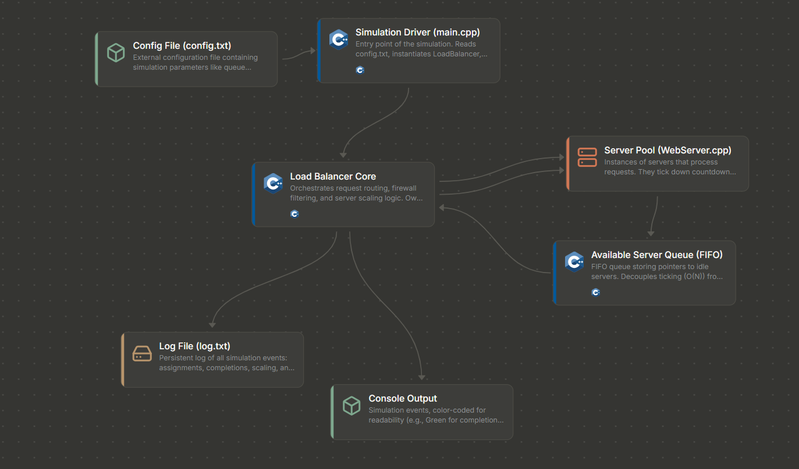

Load balancer simulation in C++. A pool of servers pulls requests off a FIFO
queue, the fleet scales up/down based on queue depth, and a firewall blocks
a configurable IP range. It's all a simulated clock (cycles), no real sockets.

## build

    make

(windows: mingw32-make)

## run

    ./loadbalancer

Reads settings from config.txt. Set askUserInput=false to skip the prompts
and just use the numbers from the config.

    queueMin / queueMax               per-server queue thresholds for scaling down/up
    scalingCooldown                   cycles to wait between scaling actions
    newRequestProbability             chance of a new request arriving each cycle
    minRequestTime / maxRequestTime   range for how long a request takes
    blockedStart / blockedEnd         firewall range
    seed                              RNG seed
    logFile                           where the run log gets written

Two other modes:

    ./loadbalancer --sweep   # p99 latency across a few utilization levels, fixed fleet
    ./loadbalancer --bench   # times request handling, 5 trials, prints the median

## notes

Originally a CSCE 412 project. Went back later and added seeded RNG (mt19937,
was just raw rand() before), latency percentiles, and the benchmark stuff
above. Doxygen docs are in docs/ if you want the generated reference.
